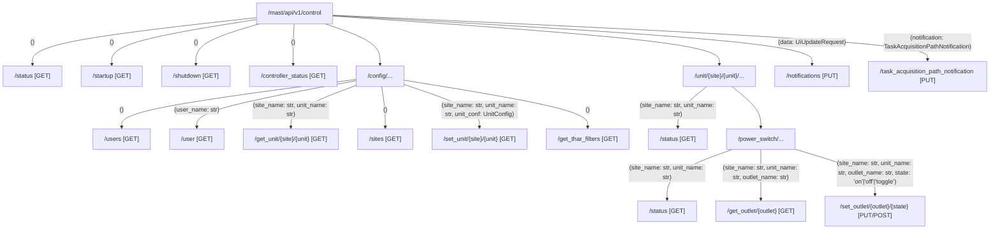

# Control API Diagram

See also: `docs/notifications-diagram.md` for end-to-end notification generation, relay, and SSE handling.

```mermaid
graph TD
    BASE["/mast/api/v1/control"]

    BASE -->|"()"| STATUS["/status [GET]"]
    BASE -->|"()"| STARTUP["/startup [GET]"]
    BASE -->|"()"| SHUTDOWN["/shutdown [GET]"]
    BASE -->|"()"| CTRL_STATUS["/controller_status [GET]"]

    BASE --> CONFIG["/config/..."]
    CONFIG -->|"()"| CFG_USERS["/users [GET]"]
    CONFIG -->|"(user_name: str)"| CFG_USER["/user [GET]"]
    CONFIG -->|"(site_name: str, unit_name: str)"| CFG_GET_UNIT["/get_unit/{site}/{unit} [GET]"]
    CONFIG -->|"()"| CFG_SITES["/sites [GET]"]
    CONFIG -->|"(site_name: str, unit_name: str, unit_conf: UnitConfig)"| CFG_SET_UNIT["/set_unit/{site}/{unit} [GET]"]
    CONFIG -->|"()"| CFG_THAR["/get_thar_filters [GET]"]

    BASE --> UNIT["/unit/{site}/{unit}/..."]
    UNIT -->|"(site_name: str, unit_name: str)"| UNIT_STATUS["/status [GET]"]
    UNIT --> PS["/power_switch/..."]
    PS -->|"(site_name: str, unit_name: str)"| PS_STATUS["/status [GET]"]
    PS -->|"(site_name: str, unit_name: str, outlet_name: str)"| PS_GET["/get_outlet/{outlet} [GET]"]
    PS -->|"(site_name: str, unit_name: str, outlet_name: str, state: 'on'|'off'|'toggle')"| PS_SET["/set_outlet/{outlet}/{state} [PUT/POST]"]

    BASE -->|"(data: UiUpdateRequest)"| NOTIF["/notifications [PUT]"]
    BASE -->|"(notification: TaskAcquisitionPathNotification)"| ACQ["/task_acquisition_path_notification [PUT]"]
```
