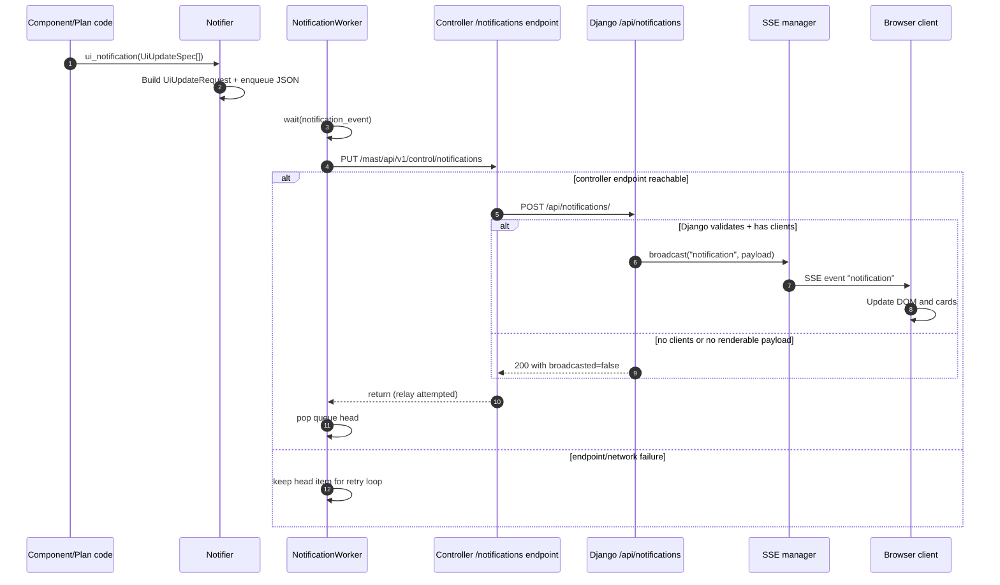

# Notifications Flow

This document maps how notifications are generated, propagated, and handled, starting from `common/notifications.py`.

## UI update notifications (`UiUpdateRequest`)

```mermaid
flowchart LR
	subgraph P[Generation]
		P1["Component/plan code calls\nActivities.start_activity or end_activity\n(common/activities.py)"] --> P2["Build UiUpdateSpec\n(path, value, dom, card)"]
		P2 --> P3["Notifier.ui_notification(ui_specs)"]
	end

	subgraph N[Notifier internals in common/notifications.py]
		N0["Module init resolves NotificationInitiator\n(site, type, hostname, project)"] --> N1
		P3 --> N1["Build UiUpdateRequest(type=ui_notification, initiator, messages[])"]
		N1 --> N2["Serialize to JSON and enqueue in deque(maxlen=10)"]
		N2 --> N3["NotificationWorker thread waits on Event"]
		N3 --> N4["ControllerApi(site_name=initiator.site).put('notifications', data=json)\nPUT /mast/api/v1/control/notifications"]
		N4 -->|success| N5["popleft from queue"]
		N4 -->|failure| N6["leave head item in queue and retry later"]
	end

	subgraph C[Controller relay in MAST_control]
		C1["app.py includes Controller().api_router"] --> C2["controller.notifications_endpoint(data: UiUpdateRequest)\nPUT /mast/api/v1/control/notifications"]
		C2 --> C3["POST JSON to Django\nhttp://DJANGO_HOST:DJANGO_PORT/api/notifications/"]
		C3 -->|200| C4["relay complete"]
		C3 -->|non-200 or exception| C5["log warning/error (no controller retry)"]
	end

	subgraph G[Django handling in MAST_gui]
		G1["views.handle_notification\nPOST /api/notifications/"] --> G2["UiUpdateRequest.model_validate_json(request.body)"]
		G2 --> G3["notification_handler.update_sse_message_from_update_request"]
		G3 --> G4["cards[] from message.card"]
		G3 --> G5["doms[] from message.dom"]
		G4 --> G6["sse_manager.broadcast('notification', data)"]
		G5 --> G6
		G6 --> G7["Per-client queue (maxsize=100)"]
		G7 --> G8["views.sse_stream sends SSE events"]
		G8 --> G9["Browser updates DOM and notification cards"]
	end

	N4 --> C2
	C3 --> G1

	GX["update_cache_from_update_request(...) exists\nin notification_handler.py"] -."currently not called by handle_notification".-> G1
```

## UI update sequence (runtime order)

## Task acquisition path notifications (`TaskAcquisitionPathNotification`)

```mermaid
flowchart LR
	T1["Unit/spec process calls\nnotify_controller_about_task_acquisition_path(...)\n(common/tasks/notifications.py)"] --> T2["ControllerApi.put('task_acquisition_path_notification', data)"]
	T2 --> T3["Controller.task_acquisition_path_notification\nPUT /mast/api/v1/control/task_acquisition_path_notification"]
	T3 --> T4["Validate in-progress task id"]
	T4 --> T5["Create symlink:\n<run_folder>/<initiator.hostname>/<subpath> -> src"]
	T5 --> T6["Used for product collection\n(no Django/SSE propagation)"]
```

## Notes

- In `MAST_control`, direct `Notifier.ui_notification(...)` calls are in `common/activities.py`.
- `common/models/plans.py` calls `start_activity/end_activity`, but current controller flow has `plan.execute(...)` commented out in `control/controller.py`.
- `Notifier` queue is bounded (`maxlen=10`), so sustained send failures can drop oldest queued notifications.
- Controller relay timeout to Django is 5 seconds in `notifications_endpoint`.

## Actionable TODOs

- [ ] Add explicit handling for full notifier queue in `common/notifications.py` (drop policy + warning/metric).
- [ ] Add retry backoff (and optional max-retries/dead-letter logging) in `Notifier._notification_worker` to avoid tight retry loops.
- [ ] Add optional retry/backoff in `controller.notifications_endpoint` when Django relay fails.
- [ ] Decide whether `update_cache_from_update_request` should be called from Django `handle_notification`; wire it in or remove stale helper.
- [ ] Align DOM render enum across producer/consumer (`common/notifications.py` uses `"text"`, GUI handler currently matches `"txt"`).
- [ ] Document expected startup ordering for notification path (controller up, Django up, SSE clients connected) and failure behavior.
